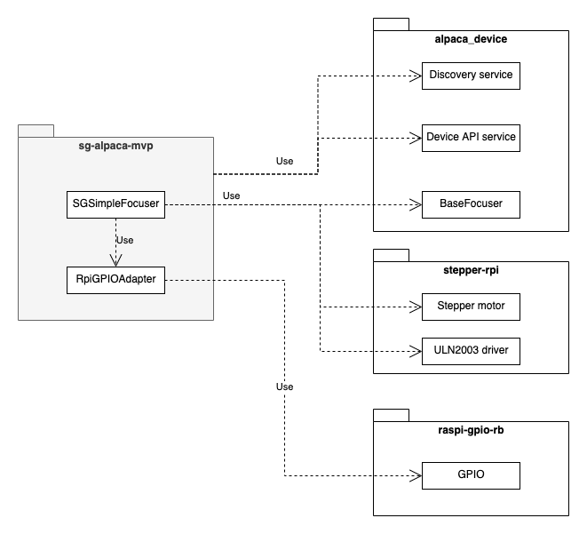

# SG Alpaca device - MVP version

The SG Alpaca device MVP version implements the [ASCOM
Alpaca](https://www.ascom-standards.org/Developer/Alpaca.htm) specifications in
order to control the manually built focuser through the ASCOM-compatible
astronomical software.

The MVP version was specifically built in order to check all the involved
pieces together by launching it on the RaspberryPi. Another pieces are the set
of libraries specifically built for creating ASCOM Alpaca devices:

- [alpaca-device](https://github.com/sergio1990/alpaca-device) - the ruby gem,
  which provides all needed ASCOM Alpaca-compatible APIs - discovery
API/management API/device API
- [stepper-rpi](https://github.com/sergio1990/stepper_rpi) - the ruby gem,
  which encapsulates all the logic needed to control the stepper motor from the
Raspberry Pi

The components diagram is presented below:



## Setup steps

1. Prepare the Raspberry Pi - configure wi-fi, install ruby
2. Edit `~/.profile` by adding asdf bin&shims folders into the PATH
3. Clone the repo
4. Open the repo root folder
5. Run `bin/setup` script
6. Update the `.env` file with own settings
7. Run `bin/export` script - it will generate systemd compatible config files
and put them into the corresponding system folder. The script  requires one
argument - the name of the user the alpaca device will be run under; I've used
just a user `pi` created automatically when setupping my Raspberry Pi.

There are other useful commands:

- `systemctl status sg-alpaca.target` - to check the running status
- `systemctl status sg-alpaca-api.1.service` - to check the running status of
  the device API module
- `systemctl status sg-alpaca-discovery.1.service` - to check te running status
  of the discovery module

Ideally, after all the mentioned steps the sg-alpaca target will be
automatically run on system startup time. The `systemctl status ...` command as
well as `journalctl -u ...` one both can be used to get stdout&stderr outputs
of the desired service for debugging any issues.

## USB-gadget mode

Everything works just fine when the computer and the raspberry are both
connected to the same wi-fi network. But it could be the case when there is no
possibility to have some router nearby, hence, there should another way how to
connect the raspberry pi to the computer, so that the former is visible as a
appropriate Alpaca device. One of the such ways is to connect the raspberry pi
to the computer via the USB cable, but for this the raspberry pi has to be
configured in a specific way - there are a lot of resources over the internet
guiding how to make the raspberry pi to be a USB-gadget, some of them includes:

- [Turning your Raspberry Pi Zero into a USB
  Gadget](https://learn.adafruit.com/turning-your-raspberry-pi-zero-into-a-usb-gadget)
- [RASPBERRY PI ZERO USB/ETHERNET GADGET
  TUTORIAL](https://www.circuitbasics.com/raspberry-pi-zero-ethernet-gadget/)

Also, it's worth to mention that the raspberry pi in the USB-gadget mode can
have troubles with proper recognizing by the Windows system. Please, take a
look at [this](https://forums.raspberrypi.com/viewtopic.php?t=245184) forum
thread helping out how to overcome that issue.

### Set static IP

By default in USB-gadget mode the raspberry pi will get a dynamic IP causing
some troubles in connection to the alpaca device each time after rebooting the
raspberry pi. This can be fixed by setting up the static IP, but this require a
couple of steps to be done on both raspberry PI and windows sides:

1. It's better to set a static MAC address for the usb0 network interface. The
   actual MAC adress can be taken by connecting the raspberry PI to the windows
machine and run `ipconfig /all`, find the corresponding network configuration
section and copy the assigned MAC address. Then open the `/boot/cmdline.txt`
file on the raspberry PI and add to the end of line -
`g_ether.host_addr=XX:XX:XX:XX:XX:XX`. After rebooting the raspberry PI the
specified MAC address will be used everytime instead of being dynamically
assigned. This step will fix an issue when the new network is created each time
by the Windows because the MAC address is different.
2. Set the static IP for the usb0 network interface. Open the
   `/etc/dhcpcd.conf` and add the following lines at the end of the file:
```
interface usb0
static ip_address=192.168.0.10/24
static routers=192.168.0.1
static domain_name_servers=192.168.0.1
```
All the parameters can be different according to your needs, but the idea is clear.
3. Open the `Control Panel -> Network and Internet -> Network and Sharing
   Center`. Find the network related to the raspberry PI. Clink on the
connection, then open the Properties dialog. In the opened dialog find the
`TCP/IPv4`, select it and click on Properties button. In the dialog appeared on
the screen choose `Use the following IP address` and type the following values
(which correlate with ones configured on the raspberry PI side):
- IP address: _192.168.0.1_
- Subnet mask: _255.255.255.0_
All other parameters can be left empty. Close all dialogs by accepting changes.

Now the raspberry PI will receive a static `192.168.0.10` IP address and you
can verify that everything is configured correctly by pinging the IP address -
`ping 192.168.0.10`.

### Fix internet access through the wireless connection

Setting the static IP for the raspberry PI breaks the wireless internet access.
It could be not a problem at all depending on your particular situation. One of
the simplest solutions to temporary get an wireless internet access is to
disable the usb0 interface temporary by running the following sequence of
commands:

```
$ sudo ifconfig usb0 down
... the wireless internet access works now and you can do whatever your need
... but the usb gadget mode is broken now
$ sudo ifconfig usb0 up
... no wireless internet connection again
... but the usb gadget mode is in service again
```

It turned out, that enabling the static IP for the usb0 network interface moves
it to the first place for routing - hence, no internet access. This can be
checked by running the `route -n` command on the raspberry pi and the output
can be like this:

```
Kernel IP routing table
Destination     Gateway         Genmask         Flags Metric Ref    Use Iface
0.0.0.0         192.168.1.1     0.0.0.0         UG    302    0        0 wlan0
0.0.0.0         192.168.0.1     0.0.0.0         UG    202    0        0 usb0
192.168.0.0     0.0.0.0         255.255.255.0   U     202    0        0 usb0
192.168.1.0     0.0.0.0         255.255.255.0   U     302    0        0 wlan0
```

As you see the metric value for the usb0 network interface is lower comparing
to the one set for the wlan0 interface - therefore, the usb0 interface is used
for any outgoing traffic. In order to fix that we need to set the metric for
the wlan0 interface lower then the value assigned for the usb0 one. There are a
couple of ways to do that:

1. Use the
   [ifmetric](https://manpages.ubuntu.com/manpages/trusty/man8/ifmetric.8.html)
utility to modify the metric of the particular network interface - `sudo
ifmetric wlan0 100`. But this change is valid only during the current runtime
and will be overridden after rebooting the raspberry PI. The crontab can be
used for setting the metric right after rebooting.
2. Set the metric value for the wlan0 interface in the `/etc/dhcpcd.conf` file by adding the next lines:
```
interface wlan0
metric 0
```
Once rebooting the device or restarting the dhcpcd daemon the wlan0 network
interface will receive a lower metric, hence, will be used for routing. You can
verify this by running the following command:
```
$ route -n
Kernel IP routing table
Destination     Gateway         Genmask         Flags Metric Ref    Use Iface
0.0.0.0         192.168.1.1     0.0.0.0         UG    0      0        0 wlan0
0.0.0.0         192.168.0.1     0.0.0.0         UG    202    0        0 usb0
192.168.0.0     0.0.0.0         255.255.255.0   U     202    0        0 usb0
192.168.1.0     0.0.0.0         255.255.255.0   U     0      0        0 wlan0
```

It's worth to mention, modifying the metric value for the wlan0 interface and
taking it for the first place for the routing breaks the local network routing -
so you won't be able to access resources in the local network. That's a
drawback of this.

Another way to have an internet access when configured as the USB-gadget mode
is to share the access in the network sharing section on the Windows machine as
it's described
[here](https://learn.adafruit.com/turning-your-raspberry-pi-zero-into-a-usb-gadget/ethernet-tweaks),
but, for some reason, it didn't work for me because I didn't have a select box
with the network connections I wanted to share the access with.
